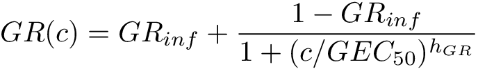

As an alternative to traditional metrics, we propose to use GR metrics,
which are based on inhibition of the growth rate over the course of the assay
and are independent of the division rate of the assayed cell lines.

Growth can be estimated at different concentrations based on the cell count at
the time of treatment (*x0*), the cell count
in the untreated control (*xctrl*), and the cell count
after treatment at concentration *c* (*x&#40;c)*):

This equation assumes exponential growth and constant growth inhibition by the
drug. Many phenomena such as drug efflux, homeostasis and adaptation can result
in non-exponential growth. In such cases, time course assays and time-dependent
GR values are better suited to evaluating drug response. Given measurements of
cell count at different time points, time-dependent GR values are defined as:

<figure>
    
    <figcaption>
        <h1>Different methods can be used to evaluate GR values.</h1>

        (left) Conceptual approach based on growth rates (k(0) and k&#40;c));
        (middle) fixed-interval approach based on cell number at the start
        (x0) and end of the experiment
        (xctrl and x&#40;c)); and (right) time-dependent approach
        based on cell count before and after a time interval
        2 × 𝚫t (x(c, t ± 𝚫t)).

    </figcaption>
</figure>

*GR&#40;c)* values (or time-dependent *GR(c,t)* values at a given time *t*)
across a range of concentrations are fitted to a sigmoidal curve:

where the fitted parameters are:

- **GRinf**: the effect of the drug at infinite concentration
  (*GRinf* = *GR(c→∞)*). *GRinf* lies between –1 and 1.
  Negative values correspond to cytotoxic responses (i.e., induction of cell
  death), and a value of 0 corresponds to a fully cytostatic response.
- **hGR**: the Hill coefficient of the fitted curve, which reflects
  how steep the dose-response curve is. In practice, we typically constrain
  *hGR* to a value between 0.1 and 5.
- **GEC50**: the concentration at half-maximal effect. To avoid
  artefacts in curve fitting we constrain *GEC50* to be within two
  orders of magnitude higher and lower than the experimentally tested
  concentration range. (In practice, this is usually about 10-7 to
  103 μM.)If the fit of the curve is not significantly better than
  that of a flat curve (i.e., *GR&#40;c)* ≡ *GRinf*) based on an
  F-test with cutoff of p = 0.05, the response is considered flat, and the
  parameter *GEC50* is set to 0.

If time-dependent *GR(c,t)* values are used, GR metrics
can be estimated at a different time points to study how sensitivity evolves
over time.

### Inferred drug response metrics

The *GR50* value is the concentration of drug at which *GR(c =
GR50) = 0.5*. If the value for *GRinf* is above 0.5, the
*GR50* value is not defined and is therefore set to +∞. By extension,
other thresholds can be defined in a similar manner. For example,
*GR100* corresponds to the concentration at which a drug is fully
cytostatic: *GR(c = GR100) = 0*.

*GRmax* is the maximum effect of the drug at the highest tested
concentration. It lies between –1 and 1. A value of 0 corresponds to a fully
cytostatic response, and negative values correspond to a cytotoxic response.
*GRmax* can be estimated from the fitted curve or obtained directly
from experimental data. (We often do the later.)

For time course data, all metrics are evaluated at each time point individually.

### Area under the curve and over the curve (GRAOC)

Another common metric for quantifying dose response is the area under the
response curve (AUC), which is based on integrating the dose-response curve over
the range of tested concentrations. In the case of GR curves, which can have
negative values, it is more intuitive to use the area over the curve:

where *GR(ci)* are measured GR values at discrete concentrations
*ci*. *GRAOC* has the benefit that, in the case of no
response, it has a value of 0. It is important to note that *GRAOC*
values (like conventional AUC) can only be used to compare responses evaluated
across the same drug concentration range.

The *GRAOC* value captures variation in potency and efficacy at the
same time. The calculation of *GRAOC* at discrete (experimentally
determined) concentrations has the advantage that it does not require curve
fitting and is therefore free of fitting artifacts. This is especially useful
for assays where fewer than five concentrations are measured and curve fitting
is unreliable. *GRAOC* values are also more robust to experimental
noise than metrics derived from curve fitting; e.g. *GRmax* is
particularly sensitive to outlier values when directly obtained from data.

<figure>
    
    <figcaption>
        <h1>Examples of dose-response curves and fits.</h1>

        The upper panels depict strong responses to drugs for which all
        sensitivity parameters can be defined. In contrast, in the case shown in
        the lower left panel, GRinf is
        above 0.5, so GR50 cannot be
        defined (and thus is set to ∞). In the case
        shown in the lower right panel, the response is weak and noisy, so the
        sigmoidal fit is not significant, and a straight flat line is fitted.
        Nevertheless, only GRAOC and GRinf can be defined.

    </figcaption>
</figure>
